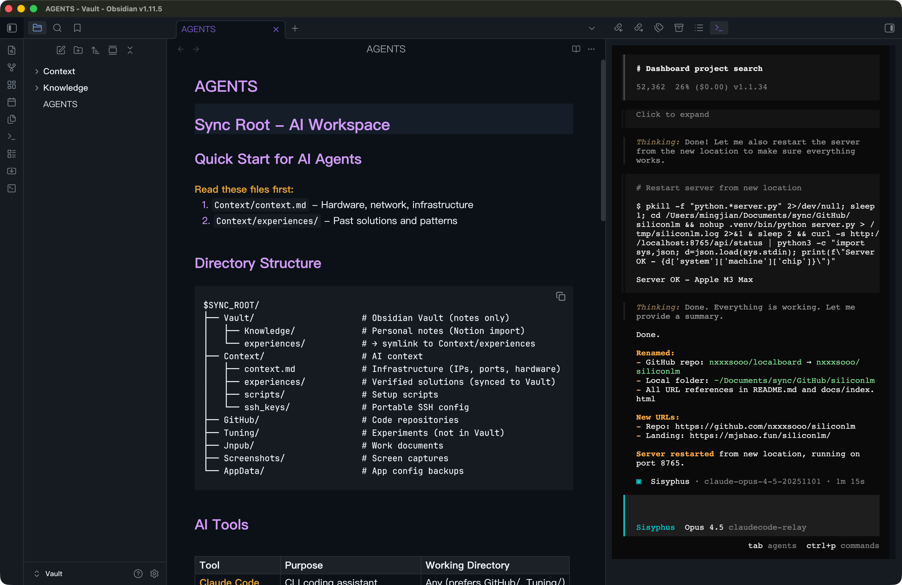

  

<h1 align="center">OpenCode Theme for Obsidian</h1>

  <strong>A dark theme inspired by the <a href="https://github.com/sst/opencode">OpenCode</a> terminal aesthetic.</strong> 
  High contrast · Terminal-native · Built for focus.

  
  
  
  

---

## Design Philosophy

> Write in the dark. Focus on the code.

OpenCode Theme brings the terminal to your vault — deep blacks, precise contrast, and a palette tuned for extended reading and writing sessions. Inspired by [OpenCode](https://github.com/sst/opencode) and [Ghostty](https://ghostty.org) terminal aesthetics.

---

## Color Palette

| | Element | Hex | Role |
|---|---------|-----|------|
| 🟣 | **Primary** | `#8a6cc4` | Accent, links, interactive |
| 🟪 | **Secondary** | `#d19af8` | Headings, keywords, emphasis |
| 🟢 | **Success** | `#5fd4bb` | Tags, properties, strings |
| 🟡 | **Warning** | `#f0a830` | Bold text, highlights |
| 🔴 | **Error** | `#ff8299` | Errors, deletions |
| 🔵 | **Info** | `#7aa2f7` | Selections, focused states |
| ⬛ | **Background** | `#0d1117` | Deep black base |
| ⬜ | **Text** | `#f0f6fc` | High contrast foreground |

---

## Features

#### ⌨️ Terminal-First Design
Color scheme derived from OpenCode/Ghostty terminal — feels native to developers.

#### 👁️ High Contrast
`#f0f6fc` on `#0d1117` — optimized for readability in dark environments.

#### 🔤 Font Smoothing
Antialiased rendering with `text-stroke` thickening for crisp text on Retina displays.

#### 🎨 Accent Customizable
Override the purple accent via **Settings → Appearance → Accent Color**.

#### 📝 Syntax Highlighting
Complete token coverage — keywords, strings, functions, properties, operators all precisely colored.

#### 💬 Callout Support
All Obsidian callout types styled with theme-consistent colors.

---

## Screenshots

  

---

## Installation

### From Obsidian Community Themes

1. Open **Settings** → **Appearance** → **Themes**
2. Click **Manage** → **Browse**
3. Search for `OpenCode`
4. Click **Install and use**

### Manual Installation

1. Download [`theme.css`](theme.css) and [`manifest.json`](manifest.json)
2. Create folder: `{vault}/.obsidian/themes/OpenCode/`
3. Place both files in the folder
4. Enable in **Settings** → **Appearance** → **Themes**

---

## Recommended Settings

| Setting | Value |
|---------|-------|
| **Interface Font** | PingFang SC / SF Pro Text |
| **Text Font** | PingFang SC |
| **Monospace Font** | JetBrains Mono |
| **Accent Color** | `#8a6cc4` |

---

## Credits

- Terminal aesthetic from [OpenCode](https://github.com/sst/opencode)
- Font rendering tuned for [Ghostty](https://ghostty.org)

---

## License

[MIT](LICENSE) © [nxxxsooo](https://github.com/nxxxsooo)
